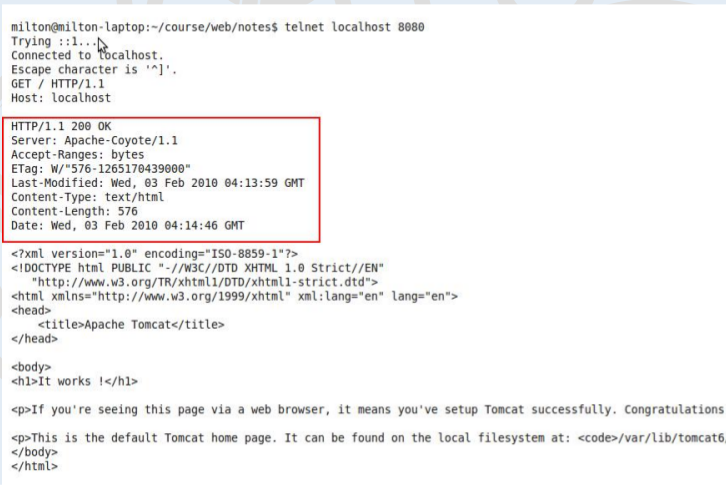

# Web Technologies
M.E. (CSE) Semester 2
R S Milton
Department of Computer Science and Engineering

# Web Essentials
February 25, 2018

# Domain Name Service (DNS)
- DNS is the “phone book” for the Internet
- Map between host names and IP addresses
- DNS often uses UDP for communication

# Host names
- Labels separated by dots, e.g., www.example.org
- Final label is top-level domain
  - Generic: .com, .org, etc.
  - Country-code: .us, .il, etc.

# The Internet
  - Internet: the network of networks connected via the public backbone and communicating using TCP/IP communication protocol
  - Internet Protocols
    - Communication protocol: how computers talk
    - Designed for use both within local area networks (LAN’s) and between networks
  - Communication infrastructure
  - Layered architecture
    - Network layer — IP protocol
    - Transport layer — TCP protocol
    - Application layer — protocol defined by the application
  - Communication protocol
    - Message format
    - Sequence of messages exchanged between the sender and the receiver

# Higher-level Protocols
- Many protocols build on TCP
  - SMTP (email)
  - FTP (file transfer)
  - HTTP (transfer of Web documents)

# Internet and World Wide Web
- Internet is the communication infrastructure
- WWW is an information management technology
- Several other technologies
- World Wide Web
  - Originally, one of several systems for organizing Internet-based information
  - Competitors: WAIS, Gopher, ARCHIE
- Distinctive features of Web: support for hypertext (text containing links)
  - Communication via HHTP (Hypertext Transport Protocol)
  - Document representation using HTML (HyperText Markup Language)

# World Wide Web
- The Web is the collection of machines (Web servers) on the Internet that provide information, particularly HTML documents, via HTTP.
- Machines that access information on the Web are known as Web clients. A Web
browser is software used by an end user to access the Web.

# Hypertext Transport Protocol (HTTP)
- HTTP is based on the request-response communication model:
  - Client sends a request
  - Server sends a response
- HTTP is a stateless protocol:
  - The protocol does not require the server to remember anything about the client between requests.

# HTTP
- Normally implemented over a TCP connection (80 is standard port number for HTTP)
- Typical browser-server interaction:
  - User enters Web address in browser
  - Browser uses DNS to locate IP address
  - Browser opens TCP connection to server
  - Browser sends HTTP request over connection
  - Server sends HTTP response to browser over connection
  - Browser displays body of response in the client area of the browser window
- The information transmitted using HTTP is often entirely text
- Can use the Internet’s Telnet protocol to simulate browser request and view server response
  - Connect
  - Send Request
  - Receive Response

```
$ telnet www.example.org 80
Trying 192.0.34.166...
Connected to www.example.com
(192.0.34.166).
Escape character is ’^]’.
GET / HTTP/1.1
Host: www.example.org
HTTP/1.1 200 OK
Date: Thu, 09 Oct 2003 20:30:49 GMT
```
# HTTP Request
- Structure of the request:
  - start line
  - header field(s)
  - blank line
  - optional body



## Start line
  - Example: GET / HTTP/1.1
  - Three space-separated parts
    - HTTP request method
    - Request-URI
    - HTTP version
- Uniform Resource Identifier (URI)
  ```http://www.example.com/```
  - The scheme is http
  - In addition to http, some other URL schemes are https, ftp, mailto, and file
- Request-URI is the portion of the requested URI that follows the host name (which is supplied by the required Host header field)
  - Ex: / is Request-URI portion of `http://www.example.com/`
- Uniform Resource Locator (URL)
  - Specifies location at which a resource can be found

## HTTP Request methods
- GET
  - Used if link is clicked or address typed in browser
  - No body in request with GET method
- POST
  - Used when submit button is clicked on a form
  - Form information contained in body of request
- HEAD
  - Requests that only header fields (no body) be returned in the response

## Header field structure:
- Syntax
  - field name : field value
  - Field name is not case sensitive
  - Field value may continue on multiple lines by starting continuation lines with white space
  - Field values may contain MIME types, quality values, and wildcard characters (*’s)

## Multipurpose Internet Mail Extensions (MIME)
- Convention for specifying content type of a message
- In HTTP, typically used to specify content type of the body of the response
- MIME content type syntax:
  - top-level type / subtype
  - Examples: text/html, image/jpeg
- HTTP Quality Values and Wildcards
  - Example header field with quality values:
```
accept:
text/xml,text/html;q=0.9,
text/plain;q=0.8, image/jpeg,
image/gif;q=0.2,*/*;q=0.1
```
- Quality value applies to all preceding items
- Higher the value, higher the preference
- Note use of wildcards to specify quality 0.1 for any MIME type not specified earlier

## Common header fields
- Host: host name from URL (required)
- User-Agent: type of browser sending request
- Accept: MIME types of acceptable documents
- Connection: value close tells server to close connection after single request/response
- Content-Type: MIME type of (POST) body, normally application/x-www-form-urlencoded
- Content-Length: bytes in body
- Referer: URL of document containing link that supplied URI for this HTTP request

# HTTP Response
Structure of the response:
- status line
- header field(s)
- blank line
- optional body

## HTTP Response example
- Status line
  - Example: HTTP/1.1 200 OK
- Three space-separated parts:
  - HTTP version
  - status code
  - reason phrase (intended for human use)

## Status code
- Three-digit number
- First digit is class of the status code:
1 = Informational
2 = Success
3 = Redirection (alternate URL is supplied)
4 = Client Error
5 = Server Error
- Other two digits provide additional information

## Common header fields
- Connection, Content-Type, Content-Length
- Date: date and time at which response was generated (required)
- Location: alternate URI if status is redirection
- Last-Modified: date and time the requested resource was last modified on the server
- Expires: date and time after which the client’s copy of the resource will be out-of-date
- ETag: a unique identifier for this version of the requested resource (changes if resource changes)

# Client Caching
- A cache is a local copy of information obtained from some other Resource
- Most web browsers use cache to store requested resources so that subsequent requests to the same resource will not necessarily require an HTTP request/response
  - Ex: icon appearing multiple times in a Web page


- Cache advantages
  - (Much) faster than HTTP request/response
  - Less network traffic
  - Less load on server
- Cache disadvantage
  - Cached copy of resource may be invalid (inconsistent with remote version)
- Validating cached resource:
  - Send HTTP HEAD request and check LastModified or ETag header in response
  - Compare current date/time with Expires header sent in response containing resource
  - If no Expires header was sent, use heuristic algorithm to estimate value for Expires
  ```Ex: Expires = 0.01 * (Date – Last-Modified) + Date```
